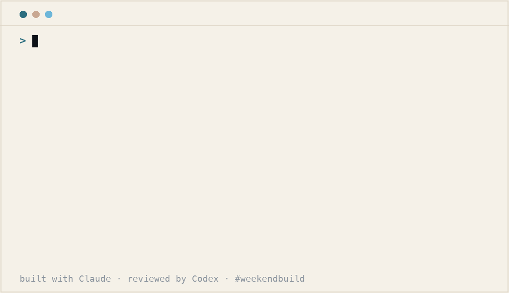

# PaperRadar 🛰️📄

An **MCP server** that pulls the **latest papers in your field** into Claude (or any MCP client).

Ask your assistant:

> *"What's new in cyanobacteria pigment research this week? Summarize the top 5."*

…and it fetches recent papers (journals **and** preprints) from **Europe PMC**, newest first, so the model can summarize / compare them. The reasoning runs on **your** Claude/ChatGPT — PaperRadar just fetches and structures the data. **No API key. No account. Free.**

Built in a weekend (~1.5 days) as a *#weekendbuild*.



## What it gives Claude

One tool:

- **`search_recent_papers(query, days=7, limit=20)`** — latest papers matching `query`, first-published within the last `days`. Returns `title, authors, date, source, doi, url, abstract`.

## Add to Claude

**With [uv](https://docs.astral.sh/uv/) — runs straight from this repo, no PyPI needed:**

Claude Code:

```bash
claude mcp add paper-radar -- uvx --from git+https://github.com/nagidev-lab/paper-radar paper-radar
```

Claude Desktop — add to `claude_desktop_config.json`:

```json
{ "mcpServers": { "paper-radar": {
  "command": "uvx",
  "args": ["--from", "git+https://github.com/nagidev-lab/paper-radar", "paper-radar"]
} } }
```

**From source (no uv):**

```bash
git clone https://github.com/nagidev-lab/paper-radar && cd paper-radar
python -m venv .venv && .venv/bin/pip install -e .
claude mcp add paper-radar -- /full/path/to/paper-radar/.venv/bin/paper-radar
```

Then just ask: *"what's new in <topic> this week?"*

_(A PyPI release is coming, which will shorten this to `uvx paper-radar`.)_

## How it works

- Data: [Europe PMC](https://europepmc.org/) REST API (covers PubMed + preprints such as bioRxiv). No auth.
- Date filter + newest-first sort done server-side; the model does the summarizing/comparing.
- Titles/abstracts are stripped of HTML entities before returning.

## Roadmap (maybe)

- more sources (arXiv, direct bioRxiv), per-paper detail, saved topics, a hosted version.

---

MIT. A weekend build — feedback welcome.
